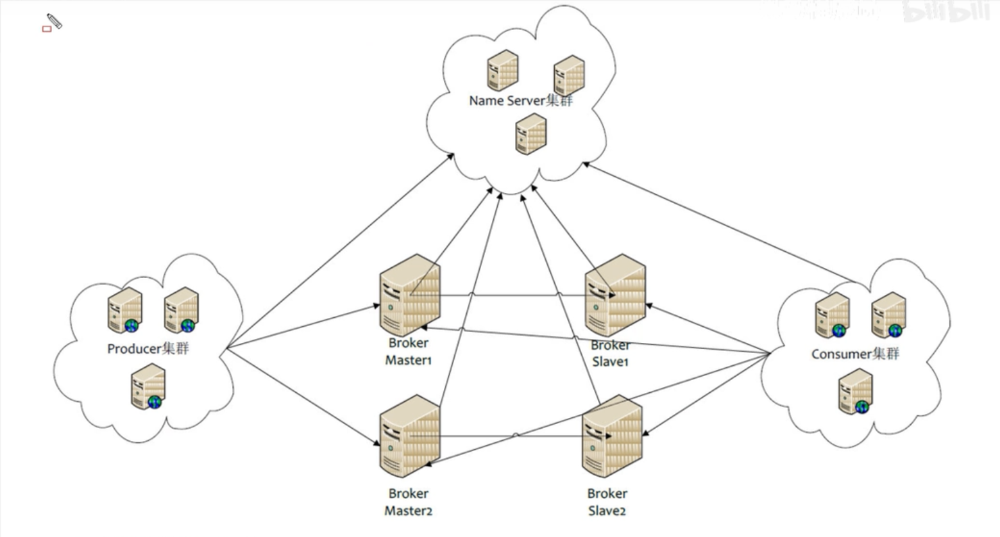

# MQ介绍

消息队列是一种先进先出的数据结构

## 优点

- **应用解耦**

  系统耦合度越高， 容错率越低， MQ可降低耦合度

  A系统发MQ给B系统， B系统挂掉不会影响到A系统

- **流量削峰**

  流量激增时， 可能会将数据库压跨， 使用MQ将用户请求缓存， 系统慢慢处理

- **数据分发**

  可将数据分发给多个系统

  A系统将数据给MQ， 其他系统想要获取数据， 只要订阅MQ即可， 不需要修改A系统代码

## 缺点

- 系统可用性降低

- 系统复杂度提高

  系统由原来的同步调用， 变为异步调用， 需解决MQ可能被重复消费，可能丢失，不同系统对MQ处理的顺序可能不一致

- 一致性问题

  多系统对MQ数据处理可能有的成功， 有的失败

## 各类MQ比较

|    特性    |        ActiveMQ         |                   RabbitMQ                    |       RocketMQ       |                 kafka                 |
| :--------: | :---------------------: | :-------------------------------------------: | :------------------: | :-----------------------------------: |
|  开发语言  |          java           |                    erlang                     |         java         |                 scala                 |
| 单机吞吐量 |          万级           |                     万级                      |        10万级        |                10万级                 |
|   时效性   |          ms级           |                     us级                      |         ms级         |               ms级以内                |
|   可用性   |     高（主从架构）      |                高（主从架构）                 | 非常高（分布式架构） |         非常高（分布式架构）          |
|  功能特性  | 较多文档， 协议支持出色 | 并发能力强，性能极其好，延时低， 管理界面丰富 | 功能完善， 扩展性佳  | 只支持主要的MQ功能， 主要为大数据准备 |

# 安装

这里使用docker安装最新版本

- docker search RocketMQ
- docker pull [下载的版本]
- docker run -it -name RocketMQ -P [镜像名]

# 目录

- benchmark   运行demo
- bin （常用）可执行文件
- conf   配置文件
- lib    依赖jar包

# 启动/停止

## **nameserver**

进入bin目录下

```cmd
# 启动
nohup sh mqnamesrv &
# 停止
sh mqshutdown namesrv
```

## **broker**

进入bin目录下

```cmd
# 启动
nohup sh mqbroker -n localhost:9876&
# 停止
sh mqshutdown mqbroker
```

**注**

RocketMQ默认分配的内存比较大， 如果broker无法正常启动， 可能是内存不足

```cmd
# 修改下面启动文件， 分配内存大小
vi runbroker.sh
vi runserver.sh
```

## **测试**

### 发送消息

```cmd
export NAMESRV_ADDR=localhost:9876
sh bin/tools.sh org.apache.rocketmq.example.quickstart.Producer
```

### 接收消息

```cmd
export NAMESRV_ADDR=localhost:9876
sh bin/tools.sh org.apache.rocketmq.example.quickstart.Consumer
```

# 日志

日志创建在root目录下

```cmd
tail -f /root/logs/rocketmqlogs/namesrv.log 
```

# 角色

- Producer: 消息提供者
- Consumer:  消息消费者
- Broker:  暂存和传输消息
- NameServer:  管理Broker, 类似注册中心
- Topic:  区分消息种类; 
- Message Queue:  相当于Topic分区(子分类),  用于并行发送和接收消息

# 集群



Producer提供消息, 先向Name Server询问, 发送给哪个Broker

Consumer消费消息, 也要先向Name Server询问, 接收哪个Broker的消息

## 特点

- Name Server, Producer, Consumer 是无状态的,  broker会给每个Name Server上报信息,  每个Name Server的数据都相同, 不需要数据交互,

  此特点, 让Name Server, Producer, Consumer  启动多个, 即可搭建集群

- Broker 分为Master, Slave, Master处理写(接收)操作,  Slave处理读(提供)操作

  Name Server 把Broker Name相同的节点当作一组,  通过Broker ID区分,  0为Master, 非0为Slave

  一个Master可有多个Slave,  一个Slave只能有一个Master

  Master会通过同步/异步, 将数据发送给Slave

- Producer与Name Server集群其中一个建立长连接,  每次发送消息都要询问Name Server,  要发送给哪个broker,  Name Server通过携带的Topic来判断

  Producer也会与Master建立长连接,  定时向Master发送心跳检测,  判断Producer状态

- Consumer与Name Server集群其中一个建立长连接,  定期询问Name Server,

  Consumer也会与Master, Slave建立长连接,  定时向Master, Slave发送心跳检测,  判断Consumer状态

  Consumer接收数据有两种方式,  一种是broker主动推送,  一种是consumer主动接收

  Consumer既可订阅Master的消息,  也可订阅Slave的消息

## 集群模式

- **单Master模式**(非集群)

  风险大,  一旦Broker重启或者宕机, 会导致整个服务不可用

- **多Master模式**

  无Slave,  全是Master

  -  **优点**

    配置简单,  单个Master宕机或重启对应用无影响,  性能最高

  - **缺点**

    单台机器宕机期间,  这台机器上未被消费的消息在机器恢复之前, 不可订阅, 消息实时形受到影响

- **多Master模式多Slave模式(异步)**

  Producer向Broker发送消息后, Broker直接返回响应

  - **优点**

    磁盘损坏, 消息丢失最少, 消息实时性不受影响, Master宕机, 消费者仍然可以从Slave消费, 性能同多Master模式一样

  - **缺点**

    Master宕机, 磁盘损坏会丢失少量消息

- **多Master模式多Slave模式(同步)**

  Producer向Broker发送消息后, Broker的Master先将数据同步到Slave,  再做响应

  - **优点**

    数据与服务都无单点故障, Master宕机情况下,  消息无延迟,  服务可用性与数据可用性非常高

  - **缺点**

    性能比异步复制模式略低, 大约10%, 发送单个消息RT略高

## 集群工作流程

1. 启动Name Server,  监听端口,  等待Broker, Producer, Consumer连接

2. Broker启动后, 与Name Server保持长连接, 定时发送心跳包.  心跳包包含当前Broker信息, 以及存储所有的Topic信息.

   注册成功后, NameServer中就有Topic和Broker的映射关系

3. 发送消息前, 先创建Topic, 创建Topic需要指定该Topic存储在哪些Broker上,  也可以在发送消息时自动创建Topic

4. Producer发送消息, 启动时先跟NameServer集群中的一台建立长连接, 并从NameServier中获取当前发送的Topic存在哪些Broker上, 轮询从队列列表中选择一个队列, 然后与队列所在的Broker建立长连接从而向Broker发消息.

5. Consumer跟Producer类似, 跟NameServer集群中的一台建立长连接,从NameServier中获取订阅的Topic存在哪些Broker上, 与Broker建立通道, 消费消息

## 安装

### 配置Host

```properties
# nameserver
172.17.0.4  rocketmq-nameserver1
172.17.0.5  rocketmq-nameserver2
# broker
172.17.0.4  rockermq-master1
172.17.0.4  rockermq-slave2
172.17.0.5  rockermq-master2
172.17.0.5  rockermq-slave1
```

### 开放端口

使用docker, 只要开启宿主机防火墙 

```cmd
# 开放端口
firewall-cmd --zone=public --add-port=[端口号]/tcp --permanent
# 重启防火墙
firewall-cmd --reload
```

### 创建消息存储路径

一号机

```bash
mkdir /usr/local/rocketmq/store/broker-a
mkdir /usr/local/rocketmq/store/broker-a/commitlog
mkdir /usr/local/rocketmq/store/broker-a/consumequeue
mkdir /usr/local/rocketmq/store/broker-a/index
mkdir /usr/local/rocketmq/store/broker-b-s
mkdir /usr/local/rocketmq/store/broker-b-s/commitlog
mkdir /usr/local/rocketmq/store/broker-b-s/consumequeue
mkdir /usr/local/rocketmq/store/broker-b-s/index
```

二号机

```bash
mkdir /usr/local/rocketmq/store/broker-b
mkdir /usr/local/rocketmq/store/broker-b/commitlog
mkdir /usr/local/rocketmq/store/broker-b/consumequeue
mkdir /usr/local/rocketmq/store/broker-b/index
mkdir /usr/local/rocketmq/store/broker-a-s
mkdir /usr/local/rocketmq/store/broker-a-s/commitlog
mkdir /usr/local/rocketmq/store/broker-a-s/consumequeue
mkdir /usr/local/rocketmq/store/broker-a-s/index
```

### 配置文件

配置双主双从同步

一号机 目录 /conf/2m-2s-sync

```properties
~ broker-a.properties  配置master

#暴露的外网IP
brokerIP1=1号服务器公网IP
brokerIP2=1号服务器公网IP
#所属集群名字
brokerClusterName=rocketmq-cluster
#broker名字，注意此处不同的配置文件填写的不一样
brokerName=broker-a
#0 表示 Master，>0 表示 Slave
brokerId=0
#nameServer地址，分号分割
namesrvAddr=rocketmq-nameserver1:9876;rocketmq-nameserver2:9876
#在发送消息时，自动创建服务器不存在的topic，默认创建的队列数
defaultTopicQueueNums=4
#是否允许 Broker 自动创建Topic，建议线下开启，线上关闭
autoCreateTopicEnable=true
#是否允许 Broker 自动创建订阅组，建议线下开启，线上关闭
autoCreateSubscriptionGroup=true
#Broker 对外服务的监听端口
listenPort=10911
#删除文件时间点，默认凌晨 4点
deleteWhen=04
#文件保留时间，默认 48 小时
fileReservedTime=120
#commitLog每个文件的大小默认1G
mapedFileSizeCommitLog=1073741824
#ConsumeQueue每个文件默认存30W条，根据业务情况调整
mapedFileSizeConsumeQueue=300000
#destroyMapedFileIntervalForcibly=120000
#redeleteHangedFileInterval=120000
#检测物理文件磁盘空间
diskMaxUsedSpaceRatio=88
#存储路径
storePathRootDir=/usr/local/rocketmq/store/broker-a
#commitLog 存储路径
storePathCommitLog=/usr/local/rocketmq/store/broker-a/commitlog
#消费队列存储路径存储路径
storePathConsumeQueue=/usr/local/rocketmq/store/broker-a/consumequeue
#消息索引存储路径
storePathIndex=/usr/local/rocketmq/store/broker-a/index
#checkpoint 文件存储路径
storeCheckpoint=/usr/local/rocketmq/store/broker-a/checkpoint
#abort 文件存储路径
abortFile=/usr/local/rocketmq/store/broker-a/abort
#限制的消息大小
maxMessageSize=65536
#flushCommitLogLeastPages=4
#flushConsumeQueueLeastPages=2
#flushCommitLogThoroughInterval=10000
#flushConsumeQueueThoroughInterval=60000
#Broker 的角色
#- ASYNC_MASTER 异步复制Master
#- SYNC_MASTER 同步双写Master
#- SLAVE
brokerRole=SYNC_MASTER
#刷盘方式
#- ASYNC_FLUSH 异步刷盘
#- SYNC_FLUSH 同步刷盘
flushDiskType=SYNC_FLUSH
#checkTransactionMessageEnable=false
#发消息线程池数量
#sendMessageThreadPoolNums=128
#拉消息线程池数量
#pullMessageThreadPoolNums=128
```

```properties
~ broker-b-s.properties  配置slave

#暴露的外网IP
brokerIP1=1号服务器公网IP
brokerIP2=1号服务器公网IP
#所属集群名字
brokerClusterName=rocketmq-cluster
#broker名字，注意此处不同的配置文件填写的不一样
brokerName=broker-b
#0 表示 Master，>0 表示 Slave
brokerId=1
#nameServer地址，分号分割
namesrvAddr=rocketmq-nameserver1:9876;rocketmq-nameserver2:9876
#在发送消息时，自动创建服务器不存在的topic，默认创建的队列数
defaultTopicQueueNums=4
#是否允许 Broker 自动创建Topic，建议线下开启，线上关闭
autoCreateTopicEnable=true
#是否允许 Broker 自动创建订阅组，建议线下开启，线上关闭
autoCreateSubscriptionGroup=true
#Broker 对外服务的监听端口
listenPort=11011
#删除文件时间点，默认凌晨 4点
deleteWhen=04
#文件保留时间，默认 48 小时
fileReservedTime=120
#commitLog每个文件的大小默认1G
mapedFileSizeCommitLog=1073741824
#ConsumeQueue每个文件默认存30W条，根据业务情况调整
mapedFileSizeConsumeQueue=300000
#destroyMapedFileIntervalForcibly=120000
#redeleteHangedFileInterval=120000
#检测物理文件磁盘空间
diskMaxUsedSpaceRatio=88
#存储路径
storePathRootDir=/usr/local/rocketmq/store/broker-b-s
#commitLog 存储路径
storePathCommitLog=/usr/local/rocketmq/store/broker-b-s/commitlog
#消费队列存储路径存储路径
storePathConsumeQueue=/usr/local/rocketmq/store/broker-b-s/consumequeue
#消息索引存储路径
storePathIndex=/usr/local/rocketmq/store/broker-b-s/index
#checkpoint 文件存储路径
storeCheckpoint=/usr/local/rocketmq/store/broker-b-s/checkpoint
#abort 文件存储路径
abortFile=/usr/local/rocketmq/store/broker-b-s/abort
#限制的消息大小
maxMessageSize=65536
#flushCommitLogLeastPages=4
#flushConsumeQueueLeastPages=2
#flushCommitLogThoroughInterval=10000
#flushConsumeQueueThoroughInterval=60000
#Broker 的角色
#- ASYNC_MASTER 异步复制Master
#- SYNC_MASTER 同步双写Master
#- SLAVE
brokerRole=SLAVE
#刷盘方式
#- ASYNC_FLUSH 异步刷盘
#- SYNC_FLUSH 同步刷盘
flushDiskType=ASYNC_FLUSH
#checkTransactionMessageEnable=false
#发消息线程池数量
#sendMessageThreadPoolNums=128
#拉消息线程池数量
#pullMessageThreadPoolNums=128
```

2号机

```properties
~ broker-b.properties  配置master
#暴露的外网IP
brokerIP1=2号服务器公网IP
brokerIP2=2号服务器公网IP
#所属集群名字
brokerClusterName=rocketmq-cluster
#broker名字，注意此处不同的配置文件填写的不一样
brokerName=broker-b
#0 表示 Master，>0 表示 Slave
brokerId=0
#nameServer地址，分号分割
namesrvAddr=rocketmq-nameserver1:9876;rocketmq-nameserver2:9876
#在发送消息时，自动创建服务器不存在的topic，默认创建的队列数
defaultTopicQueueNums=4
#是否允许 Broker 自动创建Topic，建议线下开启，线上关闭
autoCreateTopicEnable=true
#是否允许 Broker 自动创建订阅组，建议线下开启，线上关闭
autoCreateSubscriptionGroup=true
#Broker 对外服务的监听端口
listenPort=10911
#删除文件时间点，默认凌晨 4点
deleteWhen=04
#文件保留时间，默认 48 小时
fileReservedTime=120
#commitLog每个文件的大小默认1G
mapedFileSizeCommitLog=1073741824
#ConsumeQueue每个文件默认存30W条，根据业务情况调整
mapedFileSizeConsumeQueue=300000
#destroyMapedFileIntervalForcibly=120000
#redeleteHangedFileInterval=120000
#检测物理文件磁盘空间
diskMaxUsedSpaceRatio=88
#存储路径
storePathRootDir=/usr/local/rocketmq/store/broker-b
#commitLog 存储路径
storePathCommitLog=/usr/local/rocketmq/store/broker-b/commitlog
#消费队列存储路径存储路径
storePathConsumeQueue=/usr/local/rocketmq/store/broker-b/consumequeue
#消息索引存储路径
storePathIndex=/usr/local/rocketmq/store/broker-b/index
#checkpoint 文件存储路径
storeCheckpoint=/usr/local/rocketmq/store/broker-b/checkpoint
#abort 文件存储路径
abortFile=/usr/local/rocketmq/store/broker-b/abort
#限制的消息大小
maxMessageSize=65536
#flushCommitLogLeastPages=4
#flushConsumeQueueLeastPages=2
#flushCommitLogThoroughInterval=10000
#flushConsumeQueueThoroughInterval=60000
#Broker 的角色
#- ASYNC_MASTER 异步复制Master
#- SYNC_MASTER 同步双写Master
#- SLAVE
brokerRole=SYNC_MASTER
#刷盘方式
#- ASYNC_FLUSH 异步刷盘
#- SYNC_FLUSH 同步刷盘
flushDiskType=SYNC_FLUSH
#checkTransactionMessageEnable=false
#发消息线程池数量
#sendMessageThreadPoolNums=128
#拉消息线程池数量
#pullMessageThreadPoolNums=128
```

```properties
#暴露的外网IP
brokerIP1=2号服务器公网IP
brokerIP2=2号服务器公网IP
#所属集群名字
brokerClusterName=rocketmq-cluster
#broker名字，注意此处不同的配置文件填写的不一样
brokerName=broker-a
#0 表示 Master，>0 表示 Slave
brokerId=1
#nameServer地址，分号分割
namesrvAddr=rocketmq-nameserver1:9876;rocketmq-nameserver2:9876
#在发送消息时，自动创建服务器不存在的topic，默认创建的队列数
defaultTopicQueueNums=4
#是否允许 Broker 自动创建Topic，建议线下开启，线上关闭
autoCreateTopicEnable=true
#是否允许 Broker 自动创建订阅组，建议线下开启，线上关闭
autoCreateSubscriptionGroup=true
#Broker 对外服务的监听端口
listenPort=11011
#删除文件时间点，默认凌晨 4点
deleteWhen=04
#文件保留时间，默认 48 小时
fileReservedTime=120
#commitLog每个文件的大小默认1G
mapedFileSizeCommitLog=1073741824
#ConsumeQueue每个文件默认存30W条，根据业务情况调整
mapedFileSizeConsumeQueue=300000
#destroyMapedFileIntervalForcibly=120000
#redeleteHangedFileInterval=120000
#检测物理文件磁盘空间
diskMaxUsedSpaceRatio=88
#存储路径
storePathRootDir=/usr/local/rocketmq/store/broker-a-s
#commitLog 存储路径
storePathCommitLog=/usr/local/rocketmq/store/broker-a-s/commitlog
#消费队列存储路径存储路径
storePathConsumeQueue=/usr/local/rocketmq/store/broker-a-s/consumequeue
#消息索引存储路径
storePathIndex=/usr/local/rocketmq/store/broker-a-s/index
#checkpoint 文件存储路径
storeCheckpoint=/usr/local/rocketmq/store/broker-a-s/checkpoint
#abort 文件存储路径
abortFile=/usr/local/rocketmq/store/broker-a-s/abort
#限制的消息大小
maxMessageSize=65536
#flushCommitLogLeastPages=4
#flushConsumeQueueLeastPages=2
#flushCommitLogThoroughInterval=10000
#flushConsumeQueueThoroughInterval=60000
#Broker 的角色
#- ASYNC_MASTER 异步复制Master
#- SYNC_MASTER 同步双写Master
#- SLAVE
brokerRole=SLAVE
#刷盘方式
#- ASYNC_FLUSH 异步刷盘
#- SYNC_FLUSH 同步刷盘
flushDiskType=ASYNC_FLUSH
#checkTransactionMessageEnable=false
#发消息线程池数量
#sendMessageThreadPoolNums=128
#拉消息线程池数量
#pullMessageThreadPoolNums=128
```

### 修改启动脚本

```bash
vim /usr/local/rocketmq/bin/runbroker.sh
vim /usr/local/rocketmq/bin/runserver.sh
```

修改启动时占用内存

```properties
# 开发环境配置 JVM Configuration
JAVA_OPT="${JAVA_OPT} -server -Xms256m -Xmx256m -Xmn128m"
```

### 启动

**nameserver启动** 

分别启动每个服务器的nameserver

```bash
nohup sh mqnamesrv &
```

**broker启动**

分别启动每个broker的主从节点

```
nohup sh mqbroker -c [broker-a.properties路径] &
```

## 监控平台

### 安装

```bash
docker pull styletang/rocketmq-console-ng
```

### 启动

```bash
docker run -e "JAVA_OPTS=-Drocketmq.namesrv.addr=[namersrv地址]:9876;[namersrv地址]:9876; -Dcom.rocketmq.sendMessageWithVIPChannel=false" -p 8080:8080 -t styletang/rocketmq-console-ng
```

# 消息存储

分布式队列因为有高可靠性的要求， 所以数据要进行持久化存储

## 存储流程

1. 生产者发送消息给mq
2. mq将消息持久化存储
3. mq给生产者一个确认
4. mq给消费者发送消息
5. 消费者在本地处理完之后， 给mq一个确认
6. mq将存储的消息删除

## 持久化方式

- 关系型数据库

- 文件系统（主流）

  在写入时，使用顺序写提高速度， 在发送时， 使用零拷贝省略  “数据->内核态->用户态->网络驱动内核->网卡->数据” 中的用户态，提高速度  

  - commitlog

    mq将消息存储到commitlog， 该文件默认有1G的大小， 当1G不够存储时， 会再创建一个新的commitlog文件

  - consumerQueue

    消费逻辑队列， 存储消息在commitlog的索引， 加快mq读取消息的速度

    consumer在消费时， mq会通过索引快速的去commitlog中查找消息

    如果comsumerQueue丢失，  mq会通过commitlog将consumerQueue还原

  - indexFile（不常用）

    通过key或者时间区， 去查commitlog
    
## 刷盘机制

  - 同步刷盘

    mq接到消息后， 先将消息存储到内存中，然后该线程阻塞， 通知刷盘线程， 刷盘线程将数据存储到磁盘中， 存储成功后， 会唤醒阻塞的线程， 然后对生产者做出响应

  - 异步刷盘（推荐）

    与同步刷盘相比， 不阻塞当前线程， 直接对生产者做出响应， 当内存里的消息积累到一定程度时，统一触发写入磁盘的操作，快速写入

  - 配置

    ```properties
    # broker.properties
    
    # 同步刷盘
    flushDiskType=SYNC_FLUSH
    # 异步刷盘
    flushDiskType=ASYNC_FLUSH
    ```

    


### 速度

文件系统 > 关系型数据库

# 高可用性

## 消费者

消费者无需指定从master 或者slave 读取消息，  系统会自动切换

## 生产者

建立broker集群， 保证在一个broker挂掉时，mq可正常写入

# 消息主从复制

## 同步复制（推荐）

master和slave都写成功， 才给客户端反馈写成功

优点：更安全， master如果挂掉， slave有全部的备份数据

缺点： 数据量大时， 有写入延迟

## 异步复制

master写成功， 就会给客户端反馈写成功

优点： 低延迟

缺点： 可靠性低， 可能会丢失数据

## 配置

```properties
# broker.properties

# 异步复制
brokerRole=ASYNC_MASTER
# 同步复制
brokerRole=SYNC_MASTER
# 从节点， 配置SLAVE
brokerRole=SLAVE
```

# 负载均衡

## 生产者

使用轮询方式， 让消息散落到不同的queue上， queue又会散落到不同的broker上

内部已经实现

## 消费者

### 集群模式（默认, 负载均衡）

只消费一次

每一个消费者，至少需要绑定一个queue， 如果消费者超出queue数量， 会触发Rebalance重新分配

### 广播模式

每个服务都消费一次

# 消息重试

保障消息，一定会被消费掉

## 顺序消息重试

对于顺序消息， 当消费者消费失败， 消费队列会自动的不断的进行消费重试（每次间隔1秒，顺序消费， 前一个消息没有消费完成， 无法进行下次消费）， 这时， 应用会出现消息消费被阻塞的情况。

因此在使用顺序时， 务必保证应用程序能够及时监控到并处理消费失败的情况， 避免阻塞的现象发生

## 无序消息重试

仅对集群方式有效， 对广播方式无效

- 重试次数

  最多允许重试16次， 每一次间隔， 时间会越来越长， 超过16次后， 不会在被消费， 进入死信队列

## 配置

```java
？？？
```

# 死信队列

存放消费失败的消息，  默认保存三天

可在控制台触发死信队列， 再次进行消费

# 消费幂等性

在互联网应用中， 可能会出现重复的消息， 不管消费多少次， 最终的结果是相同的， 这就是消费幂等性

## 处理方式

```java
// 发送方， 设置业务key
Message message = new Message();
message.setKey("xxx");
SendResult s = producer.send(message);


// 消费方对key进行判断是否被消费过， 已消费过就不处理， 未消费过， 消费后，将该key存储
String key = message.getKey();
```


# 项目

## 搭建

### 添加客户端依赖

```xml
<dependency>
    <groupId>org.apache.rocketmq</groupId>
    <artifactId>rocketmq-client</artifactId>
    <version>4.4.0</version>
</dependency>
```

## 生产者

### 消息发送者步骤分析

1. 创建消息生产者producer, 并制定生产者组名
2. 指定nameserver地址
3. 启动produrcer
4. 创建消息对象, 指定Topic主题, Tag和消息体
5. 发送消息
6. 关闭生产者producer

## 消费者

### 消息消费者步骤分析

1. 创建消费者consumer, 指定消费者组名
2. 指定nameserver地址
3. 订阅主题Topic和Tag
4. 设置回调函数, 处理消息
5. 启动消费者

## 基本样例

### 消息发送

#### 发送同步消息

可靠性高, 适用于重要的消息通知

```java
public class SyncProducer {
    public static void main(String[] args) throws Exception {
        // 创建消息生产者producer, 并制定生产者组名
        DefaultMQProducer producer = new DefaultMQProducer("group1");
        // 指定nameserver地址
        producer.setNamesrvAddr("172.17.0.2:9876;172.168.0.3:9876");
        // 启动produrcer
        producer.start();
        for (int i=0; i<10; i++){
            // 创建消息对象, 指定Topic主题, Tag和消息体
            Message msg = new Message("base", "tag1", ("hello world"+(i+1)).getBytes());
            // 发送消息, 并接受返回的发送状态
            SendResult result = producer.send(msg);
            System.out.println("发送结果"+result);
        }
        // 关闭生产者producer
        producer.shutdown();
    }
}	
```

#### 发送异步消息

可靠性低, 适用于对响应时间敏感的场景

```java
public class AsyncProducer {
    public static void main(String[] args) throws Exception {
        DefaultMQProducer producer = new DefaultMQProducer("group1");
        producer.setNamesrvAddr("172.17.0.2:9876;172.168.0.3:9876");
        producer.start();
        for (int i=0; i<10; i++){
            Message msg = new Message("base", "tag2", ("hello world"+(i+1)).getBytes());
            // 异步通过回调函数获取响应结果
            producer.send(msg, new SendCallback() {
                // 发送成功
                public void onSuccess(SendResult sendResult) {
                    System.out.println("发送结果:" + sendResult);
                }
                // 发送失败
                public void onException(Throwable throwable) {
                    System.out.println("发送异常:" + throwable);
                }
            });
        }
        // 立刻shutdown可能会导致回调函数, 没有等待到响应结果报异常 
        // Thread.sleep(2000);
        producer.shutdown();
    }
}

```

#### 发送单向消息

不接受响应, 适用于不关心发送结果的场景

```java
public class OnewayProducer {
    public static void main(String[] args) throws Exception {
        DefaultMQProducer producer = new DefaultMQProducer("group1");
        producer.setNamesrvAddr("172.17.0.2:9876;172.168.0.3:9876");
        producer.start();
        for (int i=0; i<10; i++){
            Message msg = new Message("base", "tag1", ("hello world"+(i+1)).getBytes());
            producer.sendOneway(msg);
        }
        producer.shutdown();
    }
}
```

### 消息接收

启动后会一直监听订阅的消息

```java
public class Consumer {
    public static void main(String[] args) throws Exception {
        // Push为推的模式
        DefaultMQPushConsumer consumer = new DefaultMQPushConsumer("group1");
        consumer.setNamesrvAddr("172.17.0.2:9876;172.17.0.3:9876");
        // 订阅消息
        consumer.subscribe("base", "tag1");
        // 订阅tag1 和tag2
        //consumer.subscribe("base", "tag1 || tage2");
        // 订阅t全部
        //consumer.subscribe("base", "*");
        // 设置监听器
        consumer.registerMessageListener(new MessageListenerConcurrently() {
            // 回调, 获取订阅的数据
            public ConsumeConcurrentlyStatus consumeMessage(List<MessageExt> list, 												ConsumeConcurrentlyContext consumeConcurrentlyContext) {
                for (MessageExt msg: list) {
                    System.out.println(new String(msg.getBody()));
                }
                return ConsumeConcurrentlyStatus.CONSUME_SUCCESS;
            }
        });
        // 启动
        consumer.start();

    }
}
```

#### 广播模式

多个消费者, 接收的mq内容相同

```java
consumer.setMessageModel(MessageModel.BROADCASTING);
```

#### 负载均衡模式(默认)

多个消费者, 均分mq消息

## 顺序消息

broker中可能有多个队列,  生产者发送多条消息, broker以轮询的方式将消息分给不同的队列, 

消费者在消费时, 使用多线程的方式去消费, 默认无法保证多个队列的消息是有序的,

为保证消息的顺序, 需要将消息全部放到一个队列中

实体

```java
public class OrderStep {
    private long orderId;
    private String desc;

    public long getOrderId() {
        return orderId;
    }

    public void setOrderId(long orderId) {
        this.orderId = orderId;
    }

    public String getDesc() {
        return desc;
    }

    public void setDesc(String desc) {
        this.desc = desc;
    }

    @Override
    public String toString() {
        return "OrderStep{" +
                "orderId=" + orderId +
                ", desc='" + desc + '\'' +
                '}';
    }

    public static List<OrderStep> buildOrders(){
        List<OrderStep> orderList = new ArrayList<OrderStep>();

        OrderStep orderDemo = new OrderStep();
        orderDemo.setOrderId(1039L);
        orderDemo.setDesc("创建");
        orderList.add(orderDemo);

        orderDemo = new OrderStep();
        orderDemo.setOrderId(1065L);
        orderDemo.setDesc("创建");
        orderList.add(orderDemo);

        orderDemo = new OrderStep();
        orderDemo.setOrderId(1039L);
        orderDemo.setDesc("付款");
        orderList.add(orderDemo);

        orderDemo = new OrderStep();
        orderDemo.setOrderId(7235L);
        orderDemo.setDesc("创建");
        orderList.add(orderDemo);

        orderDemo = new OrderStep();
        orderDemo.setOrderId(1065L);
        orderDemo.setDesc("付款");
        orderList.add(orderDemo);

        orderDemo = new OrderStep();
        orderDemo.setOrderId(7235L);
        orderDemo.setDesc("付款");
        orderList.add(orderDemo);

        orderDemo = new OrderStep();
        orderDemo.setOrderId(1065L);
        orderDemo.setDesc("完成");
        orderList.add(orderDemo);

        orderDemo = new OrderStep();
        orderDemo.setOrderId(1039L);
        orderDemo.setDesc("推送");
        orderList.add(orderDemo);

        orderDemo = new OrderStep();
        orderDemo.setOrderId(7235L);
        orderDemo.setDesc("完成");
        orderList.add(orderDemo);

        orderDemo = new OrderStep();
        orderDemo.setOrderId(1039L);
        orderDemo.setDesc("完成");
        orderList.add(orderDemo);

        return orderList;
    }

}
```


### 消息发送

```java
public class Producer {
    public static void main(String[] args) throws Exception {
        DefaultMQProducer producer = new DefaultMQProducer("group1");
        producer.setNamesrvAddr("172.17.0.2:9876;172.168.0.3:9876");
        producer.start();
        List<OrderStep> orderSteps = OrderStep.buildOrders();
        int i = 0;
        for (OrderStep order: orderSteps) {
            Message msg = new Message("OrderTopic", "order", ++i+"",(order+"").getBytes());
            /*
            *  参数
            *  消息队列选择器
            *  选择队列的业务标识
            * */
            SendResult sendResult = producer.send(msg, new MessageQueueSelector() {
                // 选择队列
                public MessageQueue select(List<MessageQueue> list, Message message, Object o) {
                    Long orderId =  (Long) o;
                    long index = orderId % list.size();
                    return list.get((int) index);
                }
            }, order.getOrderId());
            System.out.println("发送结果:" + sendResult);
            Thread.sleep(1000);
        }

        producer.shutdown();
    }
}
```

### 消息接收

```java
public class Consumer {
    public static void main(String[] args) throws Exception {
        // Push为推的模式
        DefaultMQPushConsumer consumer = new DefaultMQPushConsumer("group1");
        consumer.setNamesrvAddr("172.17.0.2:9876;172.17.0.3:9876");
        // 订阅消息
        consumer.subscribe("OrderTopic", "*");
        // 设置监听器
        // 使用MessageListenerOrderly, 在消费时, 会对一个队列, 使用一个线程去处理
        consumer.registerMessageListener(new MessageListenerOrderly() {
            public ConsumeOrderlyStatus consumeMessage(List<MessageExt> list, ConsumeOrderlyContext consumeOrderlyContext) {
                for (MessageExt msg: list
                     ) {
                    System.out.println("线程名称: " + Thread.currentThread().getName() + "消费消息: " + new String(msg.getBody()));
                }
                return ConsumeOrderlyStatus.SUCCESS;
            }
        });
        // 启动
        consumer.start();
        System.out.println("消费者启动");
    }
}
```

## 延迟消息

使用限制， 延迟的秒数是设置好的， 只需制定延迟level

```java
private String messageDelayLevel = "1s 5s 10s 30s 1m 2m 3m 4m 5m 6m 7m 8m 9m 10m 20m 30m 1h 2h";
```

```java
public class Producer {
    public static void main(String[] args) throws MQClientException, RemotingException, InterruptedException, MQBrokerException {
        DefaultMQProducer producer = new DefaultMQProducer("group1");
        producer.setNamesrvAddr("172.17.0.2:9876");
        producer.start();
        for (int i=0; i<10; i++){
            Message message = new Message("DelayTopic", "Tag1", ("Hello World" + i).getBytes());
            // 设定延迟级别
            message.setDelayTimeLevel(3);
            SendResult result = producer.send(message);
            System.out.println("发送结果：" + result);
            TimeUnit.SECONDS.sleep(1);
        }
        producer.shutdown();
    }
}
```

## 批量发送

```java
public class Producer {
    public static void main(String[] args) throws MQClientException, RemotingException, InterruptedException, MQBrokerException {
        DefaultMQProducer producer = new DefaultMQProducer("group1");
        producer.setNamesrvAddr("172.17.0.2:9876");
        producer.start();
        List<Message> list = new ArrayList<>();
        list.add(new Message("base", "Tag1", ("Hello World" + 1).getBytes()))
        list.add(new Message("base", "Tag1", ("Hello World" + 2).getBytes()))
        list.add(new Message("base", "Tag1", ("Hello World" + 3).getBytes()))
        SendResult result = producer.send(list);  
        System.out.println("发送结果：" + result);
        producer.shutdown();
    }
}
```

## 过滤消息

消费端过滤消息， 消费过滤后的消息

- tag过滤

```java
// 消费指定tag
consumer.subscribe("topic", "tag1");
// 消费多个tag消息
consumer.subscribe("topic", "tag1 || tag2");
// 消费全部tag消息
consumer.subscribe("topic", "*");
```

- 属性过滤

  支持SQL基本语法

```java
// 生产者
Message msg = new Message("base", "Tag", ("Hello World" + 1).getBytes());
// 自定义属性i， 值为10
msg.putUserProperty("i", "10");
```

```java
// 消费者, 过滤i大于5的数据
consumer.subscribe("topic", MessageSelector.bySql("i>5"));
```

## 事务消息

生产者发送事务控制消息(半消息)给MQ服务, MQ给出响应, 然后生产者去处理本地事务，可能会执行commit或者rollback，commit后， 消费者可以消费， rollback后，会将消息回滚消费者无法消费。

生产者超时未处理时， MQ服务会回调生产者的方法， 查看消息状态，再进行提交或回滚

#### 事务消息状态

- TransactionStatus.CommitTransaction: 提交事务
- TransactionStatus.RollbackTranSaction: 回滚事务
- TransactionStatus.Unknown: 中间状态

```java
public class Producer {
    public static void main(String[] args) throws MQClientException, InterruptedException {
        TransactionMQProducer producer = new TransactionMQProducer("group1");
        producer.setNamesrvAddr("152.136.157.189:9876");
        // 事务监听器
        producer.setTransactionListener(new TransactionListener() {
            // 执行本地事务
            @Override
            public LocalTransactionState executeLocalTransaction(Message message, Object o) {
                if (message.getTags().equals("tag1")){
                    return LocalTransactionState.COMMIT_MESSAGE;
                }else if(message.getTags().equals("tag2")){
                    return LocalTransactionState.ROLLBACK_MESSAGE;
                }else{
                    return LocalTransactionState.UNKNOW;
                }
            }
            // 回查
            @Override
            public LocalTransactionState checkLocalTransaction(MessageExt messageExt) {
                System.out.println("消息"+messageExt.getTags());
                return LocalTransactionState.COMMIT_MESSAGE;
            }
        });
        String[] tags = {"tag1", "tag2", "tag3"};
        producer.start();
        for (int i=0; i<3; i++){
            // 创建消息对象, 指定Topic主题, Tag和消息体
            Message msg = new Message("TransactionTopic", tags[i], ("hello world"+(i+1)).getBytes());
            // 发送消息, 并接受返回的发送状态
            SendResult result = producer.sendMessageInTransaction(msg, null);
            System.out.println("发送结果"+result);
            TimeUnit.SECONDS.sleep(1);
        }
    }
}
```

# 项目实战

## 整合springboot

### producer

#### 添加依赖

```xml
<dependency>
    <groupId>org.apache.rocketmq</groupId>
    <artifactId>rocketmq-spring-boot-starter</artifactId>
    <version>2.1.0</version>
</dependency>
<dependency>
    <groupId>org.projectlombok</groupId>
    <artifactId>lombok</artifactId>
    <version>1.18.12</version>
</dependency>
```

#### 配置文件

```yml
rocketmq:
  name-server: namesrv地址:9876
  producer:
    group: my-group
```

#### 测试连接

```java
@RunWith(SpringRunner.class)
// RocketmqProducerApplication.class 是项目启动类
@SpringBootTest(classes = {RocketmqProducerApplication.class})
@Slf4j
public class RocketmqProducerApplicationTests {

    @Autowired
    private RocketMQTemplate rocketMQTemplate;

    @Test
    public void testSendMessage(){
        rocketMQTemplate.convertAndSend("springboot-rocketmq", "Hello springboot rocketmq");
        log.info("消息发送成功");
    }
}
```

### consumer

#### 添加依赖

```xml
<dependency>
    <groupId>org.springframework.boot</groupId>
    <artifactId>spring-boot-starter-web</artifactId>
</dependency>
<dependency>
    <groupId>org.apache.rocketmq</groupId>
    <artifactId>rocketmq-spring-boot-starter</artifactId>
    <version>2.1.0</version>
</dependency>
<dependency>
    <groupId>org.projectlombok</groupId>
    <artifactId>lombok</artifactId>
    <version>1.18.12</version>
</dependency>
```

#### 配置文件

```yml
rocketmq:
  name-server: 152.136.157.189:9876
  consumer:
    group: my-group
```

#### 监听消息

RocketMQListener<？>   泛型可用

- String
- Message
- MessageExt   比Message多了消息id

```java
// consumeMode是消费模式， 并发消费/顺序消费
@RocketMQMessageListener(topic = "springboot-rocketmq", consumeMode = ConsumeMode.CONCURRENTLY, consumerGroup = "${rocketmq.consumer.group}")
@Component
public class Consumer implements RocketMQListener<String> {

    @Override
    public void onMessage(String s) {
        System.out.println("接受到消息" + s);
    }
}
```

