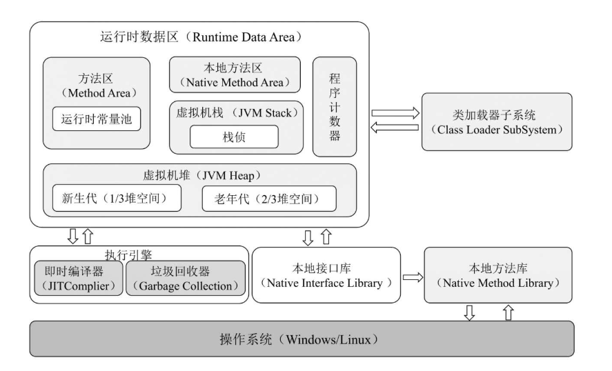
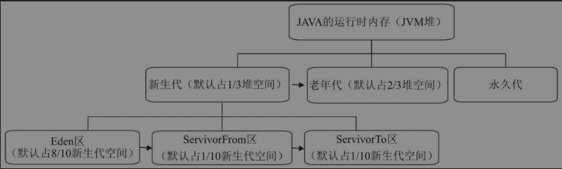
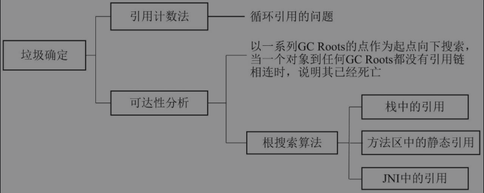
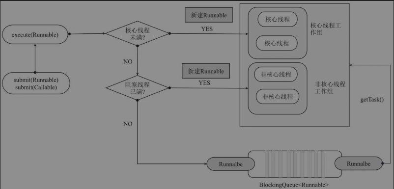

# 基础

## **String, StringBuffer, StringBuilder**

- **可变性**

  String, StringBuffer, StringBuilder的值都存在Char数组中

  其中String被final修饰, 为常量不可编辑

- **线程安全**

  String为常量是线程安全的

  StringBuffer内部的方法加了synchronized同步锁, 是线程安全的

  StringBuilder非线程安全

- **性能**

  String为常量, 每次修改值, 都要重新更改引用, 性能最低

  StringBuffer加了同步锁, 性能其次

  StringBuilder性能最高

```java
String a = "a";
String b = "b";
String c = a + b  
// 底层 new StringBuilder().append(a).appned(b).toString();
```

## 装箱和拆箱

- **手动装箱和拆箱**

  包装类都被final修饰,  不可修改

  **装箱**   Integer a = new Integer(100);

  **拆箱**   a.intValue(); 

- **自动装箱和拆箱**

  **装箱**   Integer a = 100;  底层调用 Integer.valueOf();

  **拆箱**   int b = c;   底层调用 intValue();

- **缓存池**

  数字在 -128 < x < 127 之间会从缓存中取值

  ```java
  Integer a = 10;
  Integer b = 10;
  a == b  // true
  ```

  ```java
  Integer a = 250;
  Integer b = 250;
  a == b  // false
  ```

  数字包装类在比较时, 有运算符的情况下, 比的是值

  ```java
  Integer a = 128;
  Integer b = 128;
  Integer c = 127;
  a == b // false
  a == c + 1 // true
  ```

  字符在  0 < x < 127 之间会从缓存中取值


## Java四种引用类型

- **强引用**

  最常见, 把一个对象赋值给一个引用变量时, 就是强引用, 强引用必然是可达的, 不会被垃圾回收机制回收

- **软引用**

  通过SoftReference类实现。如果一个对象只有软引用，则在系统内存空间不足时该对象将被回收。

  常用于缓存

- **弱引用**

  弱引用通过WeakReference类实现，如果一个对象只有弱引用，则在垃圾回收过程中一定会被回收。

- **虚引用**

  虚引用通过PhantomReference类实现，虚引用和引用队列联合使用，主要用于跟踪对象的垃圾回收状态。

## 类在实例化内部执行顺序

1. 加载父类的给静态变量赋值的方法, 静态代码块,  先后的顺序由代码的上下位置决定, 

   再加载子类的给静态变量赋值的方法, 静态代码块

   **静态代码块, 给静态变量赋值的方法, 在类加载时就会触发**

2. 调用父类给非静态变量赋值的方法**(如果该方法被子类重写, 则会调用子类的方法, 因为this指向当前正在创建的对象, 也就是子类的对象)**, 非静态代码块, 先后的顺序由代码的上下位置决定, 

   接着再调用父类的构造方法

3. 调用子类给非静态变量赋值的方法, 非静态代码块,先后的顺序由代码的上下位置决定, 

   最后调用子类的构造方法

## 集合

### List

**ArrayList**

基于数组实现， 查询快， 增删慢， 线程不安全

**Vector**

数据结构和ArrayList相同， 不同的是Vector是线程安全的， 操作元素的方法被synchronized修饰， 读写效率低于ArrayList

**LinkedList**

基于双向链表实现， 增删快， 查询慢

### Queue

队列

**ArrayBlockingQueue**：基于数组数据结构实现的有界阻塞队列。

**LinkedBlockingQueue**：基于链表数据结构实现的有界阻塞队列， 不指定容量就是无界队列。

**PriorityBlockingQueue**：支持优先级排序的无界阻塞队列。

**DelayQueue**：支持延迟操作的无界阻塞队列。

**SynchronousQueue**：用于线程同步的阻塞队列。只能存一个元素

**LinkedTransferQueue**：基于链表数据结构实现的无界阻塞队列。当队列中无元素时, 消费线程取元素, 队列会生成一个空节点, 消费线程等待这个节点, 后面生产线程要加入队列时, 发现空节点, 就不入队, 直接填充到空节点上, 唤醒消费线程消费.相对于LinkedBlockingQueue效率更高.

**LinkedBlockingDeque**：基于链表数据结构实现的双向阻塞队列。

**ps**: 阻塞队列是指， 如果队列是空， 一个线程要取元素会被阻塞， 直到另一个线程往里添加了元素； 

如果队列是满的， 一个线程往里加元素也会被阻塞， 等待另一个线程取出元素，空出位置。 

### Set

Set存储的集合数据不会重复

**HashSet**: 无序

HashSet存放散列值, 按照元素的散列值来存取元素, 散列值通过元素的hashCode方法计算得到.  HashSet在存放元素会先比较元素的散列值是否相等, 如果散列值相等, 再通过equals比较, 都相等视为同一元素

**TreeSet**: 有序

TreeSet基于二叉树的原理, 对新添加的对象进行排序

Integer和String等基础对象可以直接排序,  自定义的数据类型需要实现Comparable接口, 重写其中的compareTo函数才能排序

**LinkedHashSet**:  有序

LinkedHashSet在底层使用LinkedHashMap存储元素, 继承了HashSet

### Map

**HashMap**:  数组+链表/红黑树,  线程不安全

HashMap基于键的HashCode值为唯一标识,  进行存取.  每次遍历的顺序无法保证相同, key和value允许为null

**ConcurrentHashMap:**   分段锁实现,  线程安全

ConcurrentHashMap由多个Segment组成,  每个Segment单独加锁, 默认16个, 就可以同时支持16个线程并发执行写操作

**HashTable:**  线程安全

操作与HashMap类似, 是线程安全,  但是同一时间只能有一个线程可写入,  并发性不如ConcurrentHashMap

**TreeMap**:  有序

TreeMap基于二叉树数据结构, 存储数据,   使用TreeMap时其key必须实现Comparable接口或采用自定义的比较器

**LinkedHashMap**:   有序

基于HashTable数据结构, 其内部使用链表保存元素的插入顺序

## 异常

Throwable是所有错误或异常的父类,  Throwable又可分为Error和Exception, 

Error指java程序运行错误, 出现Error的原因通常是因为系统内部错误, 或资源耗尽, 无法处理, 系统只能记录错误的成因和安全终止 

Exception指程序运行时异常,即运行中的程序发生了人们不可期望的事件, 

### 异常处理方式

#### 抛出异常

将异常抛出给调用者, 调用者根据情况处理

throws在方法上定义要抛出得异常

throw手动抛出一个异常

#### 捕获异常

try catch

## 反射机制

### 反射的步骤

1. 获取想要操作的类的Class对象, 该Class对象是反射的核心, 通过它可以调用类的任意方法

   获取Class对象的三种方法

   - 调用对象的getClass方法

     ```java
     Person person = new Person();
     Class clazz = person.getClass();
     ```

   - 调用某个类的class属性

     ```java
     Class clazz = Person.class;
     ```

   - 调用Class类中的forName静态方法,  最安全, 性能最好

     ```java
     Class clazz = Class.forName("包名.类名");
     ```

2. 调用Class对象所对应的类中定义的方法, 这是反射的使用阶段

3. 使用反射API来获取并调用类的属性和方法信息

   获取类的所有方法的信息

   ```java
   Method[] method = clazz.getDeclaredMethods();
   ```

   获取类所有成员的属性信息

   ```java
   Field[] field = clazz.getDeclaredFields();
   ```

   获取类所有构造方法的信息

   ```java
   Constructor[] constructor = clazz.getDeclaredConstructors();
   ```

### 创建对象

- 使用Class对象的newInstanse方法创建Class对象对应类的实例,  这种方法要求该Class对象对应的类有默认的空构造器

  ```java
  Class clazz = Class.forName("Person");
  Person p = clazz.newInstance();
  ```

- 先获取构造方法, 使用构造方法创建对象

  ```java
  Constructor c = clazz.getDeclaredConstructor(int.class, String,class);
  Person p = (Person)c.newInstance("老王", 20);
  ```

### 调用方法

获取对象的Method,  然后通过invoke方法调用

```java
Class clazz = Class.forName("Person");
// setName是方法名, String是该方法的参数类型, 有几个写几个
Method method = clazz.getMethod("setName", String.class);
Person p = clazz.newInstance();
method.invoke(p, "老王");
```

## 内部类

### 静态内部类

定义在类内部的静态类被称为静态内部类,  静态内部类可以访问外部类的静态变量和方法,在静态内部类中可定义静态变量, 方法, 构造函数等; 静态内部类通过 "外部类. 静态内部类"的方式调用.

### 成员内部类

定义在类内部的非静态类叫做成员内部类,  成员内部类不能定义静态方法和变量(final修饰除外)

### 局部内部类

定义在方法中的类叫做局部内部类, 当一个类只需要在某个方法中使用某个特定的类时, 可以通过局部内部类来优雅的实现

### 匿名内部类

匿名内部类指通过继承一个父类或者实现一个接口的方式, 直接定义并使用的类,. 匿名类在使用时, 直接new生成一个对象, 在对象中重写方法.

## 泛型

用于约束参数类型, 提供了编译时类型的安全检测机制

### 泛型方法

```java
public class Main {
    public static void main(String[] args) {
        Main m = new Main();
        m.doSome(10, "老王");
    }
    public < T > void doSome(T ... array){
        for(T item: array){
            if(item instanceof Integer){
                System.out.println("数字");
            }else if(item instanceof String){
                System.out.println("字符串");
            }
        }
    }
}
```

### 泛型类

在类上定义一个或多个类型参数, 该参数在类实例化时传入, 类内部会将该参数作为数据类型使用

```java
public class Main<T, Q, M> {
    private T t;
    private Q q;
    private M m;
    public void set(T t, Q q, M m){
        this.t = t;
        this.q = q;
        this.m = m;
    }
    public void print(){
        System.out.println(t);
        System.out.println(q);
        System.out.println(m);
    }
    public static void main(String[] args) {
        Main<Integer, String, Double> m = new Main();
        m.set(1, "老王", 1.2);
        m.print();
    }
}
```

### 泛型接口

用法与泛型类类似,  类在实现接口时, 指定接口的泛型

```java
public interface Api<T>{
	public T print();
}
public class ApiImpl implements Api<Integer>{
	public Integer print(){
       // todo
    }
}
```

### 类型擦除

泛型在编译阶段, 会被编译器编译时去掉

## 序列化

序列化的作用是让Java对象及其状态在多个应用之间传递, 共享, 或者将对象及其状态持久化, 在其他地方重新读取被保存的对象, 并继续进行处理

常用于RPC远程调用, 网络传输

### 序列化API使用

注意事项

- 要实现序列化, 只需要实现java.io.Serializable接口即可
- 序列化和反序列化必须保持序列化的ID一致,   一般使用private staic final long serialVersionUID定义序列化ID
- 序列化并不保存静态变量
- 在需要序列化父类变量时, 父类也需要实现Serializable接口
- 使用Transient关键字可以阻止该变量被序列化, 在被反序列化后，transient变量的值被设为对应类型的初始值，例如，int类型变量的值是0，对象类型变量的值是null。

# JVM

## JVM虚拟机的组成

- **类加载器子系统**

  类加载器子系统用于将编译好的．Class文件加载到JVM中

- **运行时数据区**

  运行时数据区用于存储在JVM运行过程中产生的数据, 包括

  - 程序计数器
  - 方法区
  - 本地方法区
  - 虚拟机堆
  - 虚拟机栈

- **执行引擎**

  执行引擎包括

  - 即时编译器

    即时编译器用于将Java字节码文件, 编译成具体的机器码文件

  - 垃圾回收器

    垃圾回收器用于回收在运行过程中不在使用的对象

- **本地接口库**

  本地接口库用于调用操作系统的本地方法库完成具体的指令操作



## Java程序的运行过程

- Java源文件被编译为字节码文件
- JVM将字节码文件编译成相应操作系统的机器码
- 机器码调用相应操作系统的本地方法库执行相应的

## JVM内存区域

- 线程私有区域

  - 程序计数器

    存储java线程所执行的字节码文件的指示器

  - 虚拟机栈

    描述java方法执行过程

  - 本地方法区

    用于描述native方法执行过程

- 线程共享区域

  - 方法区

    用于存储常量, 静态变量,类信息, 即时编译器编译后的机器码,运行时常量池等数据

  - 堆

    用于存储运行时创建的对象和产生的数据

- 直接内存

## JVM运行时内存



- 新生代

  默认占三分之一堆的空间, JVM新创建的对象(除了大对象)会存放在新生代, 由于JVM频繁创建对象, 所以新生代会频繁触发GC进行垃圾回收, 新生代分为eden(伊甸园)区, ServivorTo(幸存者) 区,  ServivorFrom区

  - eden: 新创建的对象会保存在eden中, eden的内存不足会触发, MInorGC, 对新生代进行垃圾回收
  - ServivorTo: 保留上一次MinorGC的幸村者
  - ServivorFrom: 将上一次的幸存者, 作为这一次的MinorGC的被扫描者

  MinorGC采用复制算法

  （1）把在Eden区和ServivorFrom区中存活的对象复制到ServivorTo区。如果某对象的年龄达到老年代的标准, 则将其复制到老年代，同时把这些对象的年龄加1；如果ServivorTo区的内存空间不够，则也直接将其复制到老年代；如果对象属于大对象（大小为2KB～128KB的对象属于大对象，则也直接将其复制到老年代。

  （2）清空Eden区和ServivorFrom区中的对象。

  （3）将ServivorTo区和ServivorFrom区互换，原来的ServivorTo区成为下一次GC时的ServivorFrom区。

- 老年代

  老年代主要存放有长生命周期的对象和大对象。老年代的GC过程叫作MajorGC。在老年代，对象比较稳定，MajorGC不会被频繁触发。在进行MajorGC前，JVM会进行一次MinorGC，在MinorGC过后仍然出现老年代空间不足或无法找到足够大的连续空间分配给新创建的大对象时，会触发MajorGC进行垃圾回收，释放JVM的内存空间。

  MajorGC采用标记清除算法，该算法首先会扫描所有对象并标记存活的对象，然后回收未被标记的对象，并释放内存空间。

  因为要先扫描老年代的所有对象再回收，所以MajorGC的耗时较长。MajorGC的标记清除算法容易产生内存碎片。在老年代没有内存空间可分配时，会抛出Out Of Memory异常.

- 永久代

  永久代存放class和meta信息, 超出虚拟机内存会报异常

  Java8之后, 永久代被元空间取代,  元空间直接使用操作系统的内存, 不使用虚拟机内存

# 垃圾回收与算法



## 确定垃圾

### 引用计数法

java中要操作对象, 必须要先获取该对象的引用, 可通过引用计数法, 判断一个对象是否可以进行回收. 

在为一个对象添加一个引用时, 引用计数+1, 删除一个引用时, 引用计数-1. 当一个对象的引用计数为0, 则表示可以回收

**注**: 引用计数容易产生循环引用问题, 循环引用指, 两个对象互相引用, 导致引用一直存在, 无法被回收 

### 可达性分析

为了解决循环引用的问题, java采用可达性分析来判断对象是否可以被回收.

具体做法先定义一些GC roots对象, 然后以这些GC roots为起点向下搜索, 如果在GC roots与对象之间没有可到达的路径, 则说明这个对象是不可达的, 不可达对象被标记两次后, 仍然不可达, 就会被回收

## 垃圾回收算法

### 标记清除算法(老年代)

基础算法, 分为标记和清除两个阶段, 在标记阶段, 标记所需要回收的对象, 在清除阶段, 清除标记的对象并释放内存

**注**:   由于标记清除算法,在清理内存后, 没有对内存重新进行整理, 因此如果内存中的小对象居多, 会引起内存碎片化问题, 继而引起大对象无法获得连续可用的空间

### 复制算法(年轻代)

复制算法是为了解决标记清除算法内存碎片化问题而设计的, 将内存划分两块相等的区域, 区域1, 存放新生成的对象, 在区域1存满后, 对区域1中的对象进行标记, 标记存活下来的对象, 复制到区域2中, 为连续的内存, 再对区域1中的对象进行清理.

**注:**  复制法高效, 并易于实现,但浪费内存, 同时, 系统中有大量长时间存活的对象时, 这些对象将在内存区域1和2之间来回复制影响系统效率

### 标记整理算法(老年代)

结合了标记清除算法和复制算法的优点, 在标记阶段, 和标记清除算法相同, 在标记完成后, 将标记存活的对象移到内存另一端,将存活的放在同一区域, 未存活的放在同一区域, 清除未存活的对象

### 分代收集算法

标记清除散发, 复制算法, 标记整理算法都无法对所有类型的对象进行垃圾回收, 因此, 针对不同的对象采用不用的算法, 该算法时分代收集算法

分代收集算法, 让内存新生代使用复制算法, 因为新生代中有大量的对象被回收, 存活下来被复制的对象较少. 在老年代使用标记整理算法

### 分区收集算法

分区收集算法, 将堆分为连续的大小不同的小区域, 每个区域都有单独进行内存使用和垃圾回收, 这样做的好处是垃圾回收更灵活, 防止一次回收整个内存堆, 造成系统停顿时间过长, 

## JVM的类加载机制

JVM的类加载分为5个阶段：

- 加载

  jvm读取class文件， 并根据class文件的描述创建java.lang.Class对象的过程

- 验证

  验证class文件符合当前虚拟机的要求， 保障虚拟机自身安全，通过后才会加载

- 准备

- 解析

- 初始化

# 并发

## 线程的创建方式

### 继承Thread类

```java
public class Main extends Thread{
    public static void main(String[] args) {
        Main m = new Main();
        m.start();
    }
    public void run(){
        System.out.println("lalalal...");
    }
}
```

### 实现Runnable接口

```java
public class Main implements Runnable{
    public static void main(String[] args) {
        Main m = new Main();
        Thread thread = new Thread(m);
        thread.start();
    }
    public void run(){
        System.out.println("jijiji...");
    }
}
```

### 通过ExecutorService和Callable<Class>实现有返回值的线程

当需要开启多个线程执行同一个任务, 并收集各个线程执行的返回结果, 需要用的Callable接口.

```java
public class Main implements Callable<String> {
    private String name;
    public Main(String name){
        this.name = name;
    }
    @Override
    public String call() throws Exception {
        return name;
    }
    public static void main(String[] args) throws ExecutionException, InterruptedException {
        ExecutorService pool = Executors.newFixedThreadPool(5);
        List<Future> list = new ArrayList<>();
        for (int i=0; i<5; i++){
            Callable c = new Main(i + "");
            // pool.submit 提交指定的任务去执行, 并且返回Future对象
            // Future表示一个可能还没有完成的异步任务结果
            Future future = pool.submit(c);
            System.out.println("submit a callable thread:" + i);
            list.add(future);
        }
        for (Future f : list){
            // get方法让我们等待Calable结束, 并获取执行的结果
            System.out.println(f.get().toString());
        }
        pool.shutdown();
    }
}
```

### 基于线程池

```java
public class Main implements Runnable {
    public static void main(String[] args) throws ExecutionException, InterruptedException {
        // 创建线程池
        ExecutorService pool = Executors.newFixedThreadPool(10);
        for (int i=0; i<10; i++){
            pool.execute(new Main() {
                @Override
                public void run() {
                    System.out.println(Thread.currentThread().getName() + " is running");
                }
            });
        }
    }
    @Override
    public void run() {}
}
```

### 线程池工作原理

Java线程池主要用于管理线程组及其运行状态,以便Java虚拟机更好的利用cpu资源,

工作原理为: JVM先根据用户参数创建一定数量的可运行的线程任务, 将其放入队列中, 在线程创建后启动这些任务，如果线程数量超过了最大线程数量（用户设置的线程池大小），则超出数量的线程排队等候，在有任务执行完毕后，线程池调度器会发现有可用的线程，进而再次从队列中取出任务并执行。

线程池的主要作用是线程复用、线程资源管理、控制操作系统的最大并发数，以保证系统高效（通过线程资源复用实现）且安全（通过控制最大线程并发数实现）地运行。

#### 线程池的核心组件和核心类

- **线程池管理器**: 用于创建并管理线程池
- **工作线程**: 线程池中执行具体任务的线程
- **任务接口**: 用于定义工作线程的调度和执行策略, 只有线程实现了该接口, 线程中的任务才能够被线程池调度
- **任务队列**: 存放待处理的任务, 新的任务将会不断加入到队列中, 执行完的任务, 将会从队列中移除

#### 线程池的工作流程

线程池在刚创建的时候, 只向系统申请一个用于执行线程队列, 和管理线程池的线程资源, 在调用execute()添加任务时,线程池的工作流程如下

- 当正在运行的线程数量少于规定的核心线程数量, 线程池立即创建线程, 并执行任务
- 当正在运行的线程数量大于或者等于核心线程数量, 该任务被加入到阻塞队列中
- 当阻塞队列已满, 正在运行的线程数量小于最大线程数量, 线程池创建非核心线程, 并执行任务
- 当阻塞队列已满, 正在运行的线程数量大于等于最大线程数量, 线程池拒绝执行该任务, 抛出RejectExecutionException异常
- 在线程执行完毕, 该任务从阻塞队列中移除, 读取队列下一个任务执行
- 线程处于空闲状态超过设置的时间, 并且为非核心线程, 线程池会停止非核心线程.  线程池所有任务执行完毕后, 线程池大小会收缩到设置的核心线程数量的大小



### 常用线程池

- **newCachedThreadPool**  可缓存的线程池

  在创建新线程时, 如果有可用的线程, 则重用他们(任务完成但未关闭的线程)

  该线程池可无限扩大, 适用于处理时间比较小的任务

  ```java
  ExecutorService pool = Executors.newCachedThreadPool();
  ```

- **newFixedThreadPool**  固定大小线程池

  ```java
  ExecutorService pool = Executors.newFixedThreadPool(10);
  ```

- **newScheduledThreadPool**  可做任务调度的线程池

  创建了一个可定时调度的线程池, 可设置在给定的延迟时间后执行或者定期执行某个线程任务

  ```java
  ScheduledExecutorService pool = Executors.newScheduledThreadPool(3);
  pool.schedule(new Runnable() {
      @Override
      public void run() {
          System.out.println("延迟3秒, 执行一次");
      }
  }, 3, TimeUnit.SECONDS);
  
  pool.scheduleAtFixedRate(new Runnable() {
      @Override
      public void run() {
          System.out.println("延迟1秒, 每三秒执行一次");
      }
  }, 1, 3, TimeUnit.SECONDS);
  ```

- **newSingleThreadExecutor**   单个线程的线程池

  保证永远有且只有一个可用的线程, 在该线程异常或停止时, 会创建一个新的线程执行任务

  ```java
  ExecutorService pool = Executors.newSingleThreadExecutor();
  ```

- **newWorkStealingPool**  足够大小的线程池 jdk8新增

  newWorkStealingPool创建持有足够线程的线程池来达到快速运算的目的，在内部通过使用多个队列来减少各个线程调度产生的竞争。这里所说的有足够的线程指JDK根据当前线程的运行需求向操作系统申请足够的线程，以保障线程的快速执行，并很大程度地使用系统资源，提高并发计算的效率，省去用户根据CPU资源估算并行度的过程

  ```java
  ExecutorService pool = Executors.newWorkStealingPool();
  ```

### 线程生命周期

#### 线程生命周期流程

- 调用new方法新建一个线程, 线程进入新建状态
- 调用start方法启动一个线程, 线程进入就绪状态
- 处于就绪状态的线程等待线程获取cpu资源, 获取资源后, 进入运行状态
- 正在运行状态的线程, 调用了yield方法, 或者失去cpu资源, 会再次进入就绪状态
- 正在运行状态的线程, 调用了sleep方法, I/O阻塞, 等待同步锁, 等待通知, 调用suspend方法等操作后, 会挂起并进入阻塞状态, 进入blocked池.
- 阻塞状态的线程, 由于sleep时间已到,I/O方法返回结果, 获得同步锁, 收到通知, 调用resume方法等情况, 会再次进入到就绪状态, 等待cpu时间片的轮询, 获取cpu资源后, 再次进入到运行状态.

# 事务

## 事务的传播属性

- **@Transactional(propagation=Propagation.REQUIRES)**   默认

```java
// propagation=Propagation.REQUIRES 会让里面带事务的方法执行时, 共用外部方法的事务
@Transactional(propagation=Propagation.REQUIRES)
public void buy(){
    // 第一次操作成功
    updateCount();
    // 第二次操作失败, 会将第一次的操作也进行回滚, 因为共用buy方法的事务
    updateCount();
}
@Transactional
public void updateCount(){}
```

- **@Transactional(propagation=Propagation.REQUIRES_NEW)**

```java
// propagation=Propagation.REQUIRES_NEW 会让里面带事务的方法执行时, 开启自己的独立事务
@Transactional(propagation=Propagation.REQUIRES_NEW)
public void buy(){
    // 进行第一次操作, buy方法的事务挂起, 开启第一次操作的事务, 第一次操作成功, 事务结束, buy方法的事务继续
    updateCount();
    // 进行第二次操作, buy方法的事务挂起, 开启第二次操作的事务, 第二次操作失败, 不会影响到第一次操作, 因为第一次操作的事务已经提交, 事务有隔离性
    updateCount();
}
@Transactional
public void updateCount(){}
```

## 数据库事务并发问题

有两个事务**Transactional01**和**Transactional02**并发执行

### 脏读

- T1将一条记录的数值从20变为30
- T2读取了30
- T1回滚了, 30变为20
- T2读到的30就是一个无效的值

### 不可重复读

- T1读取到的值是20
- T2将值改为30
- T1再次读取值为30, 和第一次读取的不同, 为不可重复读

### 幻读

- T1从表中读取了一条数据
- T2向表中插入了一条新数据
- T1再读, 数据量和第一次不同

## 数据库隔离级别

### 读未提交(READ   UNCOMMITTED)

T2允许读到T1未提交的数据

### 读已提交(READ   COMMITTED)

T2只能读取到T1已提交的数据, **解决了脏读**

### 可重复读(REPEATABLE   READ)

确保T1可以多次从一个字段中读取到相同的值, 即T1的执行期间, 其他事务无法对T1读取的字段做修改, **解决了脏读, 不可重复读**

### 串行化(SERIALIZABLE)

确保T1可以多次从一张表中读取到相同的行, 在T1执行期间, 进行其他事务对这个表进行添加, 更新, 删除操作

可以避免任何并发问题, 但是性能很差, **解决了脏读, 幻读, 不可重复读**

## 各种数据库对隔离级别的支持

|                              | Oracle  |  MySQL  | SQL Server |
| :--------------------------: | :-----: | :-----: | :--------: |
| 读未提交(READ   UNCOMMITTED) |         |    √    |     √      |
|  读已提交(READ   COMMITTED)  | √(默认) |    √    |  √(默认)   |
| 可重复读(REPEATABLE   READ)  |         | √(默认) |     √      |
|     串行化(SERIALIZABLE)     |    √    |    √    |     √      |

## 修改事务隔离级别

```java
// 修改为读已提交
@Transactional(isolation=Isolation.READ_COMMITTED)
```

# NoSQL

## Redis

### redis持久化方式

- RDB默认的持久化方式, fork一个进程, 如果在一段时间内修改了n条数据, 这个进程就会将内存中的全量数据, 保存到持久化的文件中
  - **优点**: 性能好, 占用的空间小, redis重启服务时, 恢复数据快
  - **缺点**: 如果在没达到触发持久化的条件, redis服务异常, 内存这段时间的新数据会丢失, 当数据量大的时候, 因为是全量替换, 会影响性能 
- AOF, 每次发生写的操作, 都会记录一条操作日志, 通过日志持久化数据
  - **优点:** 数据安全性比RDB要好, 日志文件可读, 可以处理误操作
  - **缺点:** 日志占用空间大, 数据a修改了20次, 就要记录20次, 实际只会用到最后一次, 恢复数据慢, 每次都读写同步, 有性能压力

# Git

## 命令

### 分支

#### 创建分支

```bash
 git branch <分支名>
```

#### 查看分支

```bash
git branch -v
```

#### 切换分支

```bash
git checkout <分支名>
# 创建分支并切换到这个分支, 推荐使用
git checkout -b <分支名>
```

#### 合并分支

```bash
# 先切换到分支1
git checkout <分支名1>
# 将分支2的代码合并到分支1
git merge <分支名2>
```

#### 删除分支

```bash
# 切换到主分支
git checkout master
# 删除分支
git branch -D <分支名>
```


## git分支流程

- master分支, 上线用的分支, 不会直接在master分支上修改代码
- 通过master分支创建一个主开发分支
- 在主开发分支创建多个模块分支
- 模块分支开发完成, 合并到主开发分支
- 主开发分支, 创建一个测试分支
- 测试分支的代码通过后, 合并到master分支, 和主开发分支, 保持master和主开发分支代码一致
- 如果master分支发现bug, 在master分支上创建一个临时分支, 解决完bug后, 合并到master分支上和主开发分支上
